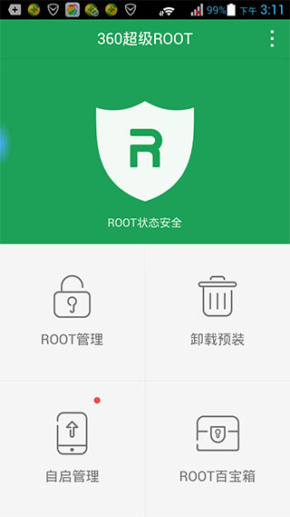
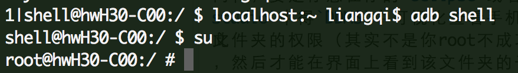
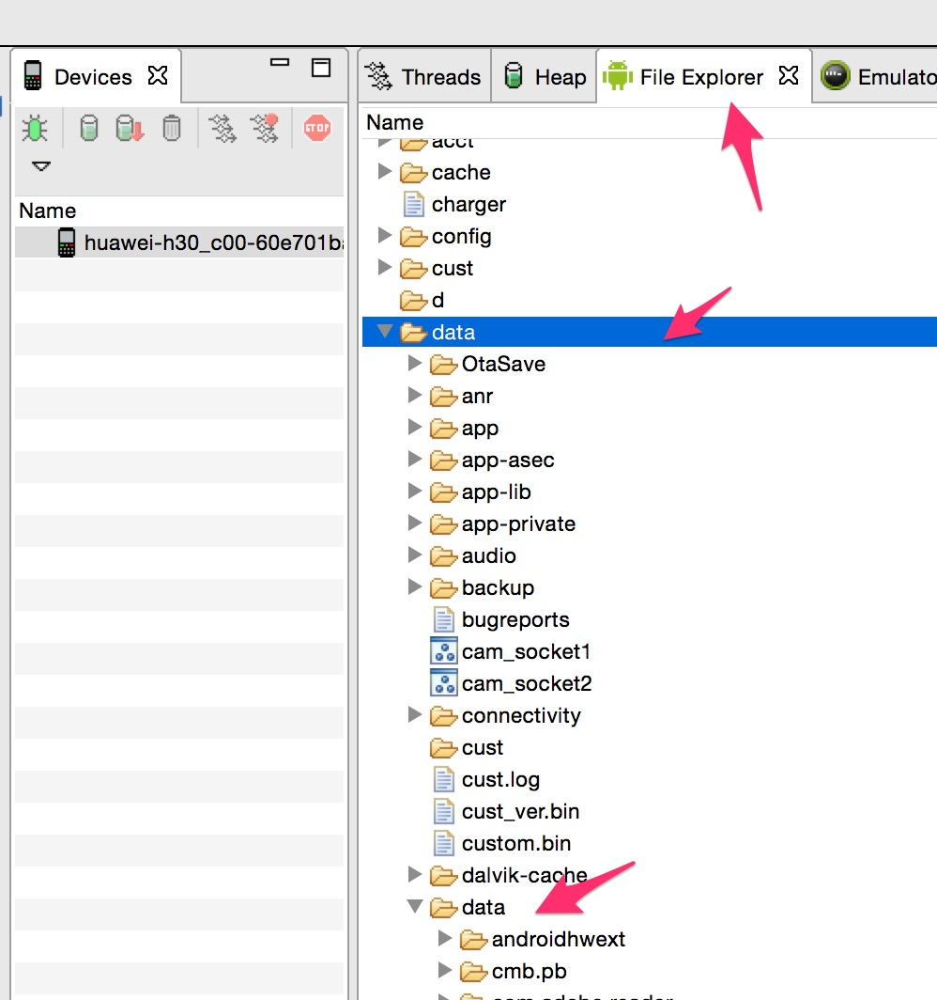

## 获取手机root权限

Q：手机好好的，为撒要`root`呢？

A：因为对于做开发的人来说，肯能需要查看手机安装包下的某些隐私文件，比如是数据库，app配置文件，缓存文件等，方便自己开发。

#### 1. root手机方法

第一步，随便找个root软件，360、百度等等都有类似的获取`root`权限的软件，选择一个安装到手机上，然后安装应用的操作直接获取`root`权限:



如果提示获取成功，那么ok，第一步算是完成了，接下里看看能不能使用adb取得手机的root用户权限：

```
adb shell
su
```
输入然`su`命令后，回车，如果命令行前面的$变为#号，那么恭喜您，你已成功`root`，这时候你可以对你的手机为所欲为，比如看看你安装包目录下数据库文件，把他导出到桌面啥的。



但是需要提醒的是，你现在拥有`root`用户的权限，但是在对其他目录操作前你可能需要更改该目录相应的权限，再做文件的操作，比如：

```
chmod 777 /data
chmod 777 /data/data
chmod 777 /data/data/com.apptut.android
chmod 777 /data/data/com.apptut.android/caches
chmod 777 /data/data/com.apptut.android/cached/database
chmod 777 /data/data/com.apptut.android/caches/database/test.db

adb pull /data/data/com.apptut.android/caches/database/test.db ~/Desktop/
```

这里比较坑爹的是，获取手机某个目录下文件所有权限，只能一层一层的获取，如果你想使用`chmod -R 777 /data` 这样的命令把`/data`目录下所有文件权限都改掉是行不通的，比较蛋疼-_-!!，你可以试试

同样，要是你想在你的`eclipse`的`DDMS`或者`android studio`中得`DDM`中可视化查看手机相应目录，你还是先得更改此文件夹的权限（其实不是你root不成功，是root你没该目录权限），然后才能在界面上看到该文件夹的子目录：




