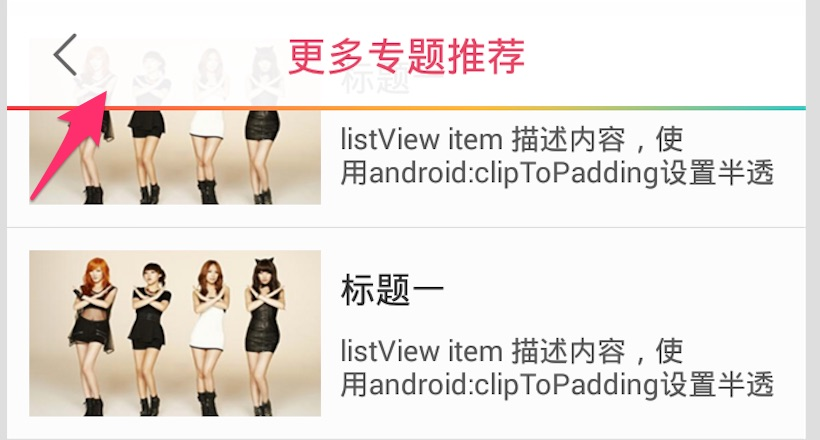

## listview常用技巧

`Android`下的`listview`坑比较多，主要是版本兼容性下带来了一些列问题：

**1. 不要使用`listSelector`**

当需要给`listview`item设置背景效果时，建议不要直接使用`listSelector`来设置背景图，因为默认`listview`自带默认背景点击效果，不同版本还不一样，而且使用`listSelector`设置的背景，在低版本上点击item时，部分android2.3设备还有点击一个Item，所有item背景都会有选中效果变化的bug。

因此建议设置`listSelector`为null或者`transprent`,然后使用每个item自己的布局文件设置背景：

```xml
<listView
    android:layout_width="match_parent"
    android:layout_height="match_parent"
    listSelector="@null" />
```

每个item布局文件：

```xml
<LinearLayout android:backgorud="@drawble/list_view_item_bg_selectors">
    <!-- 具体内容略 -->
</LinearLayout>
```

**2. 使用clipToPadding做半透效果**

要描述它的使用场景直接看下面这张图即可：



产品需求是：有一个导航条覆盖在`listview`上，并且导航有半透明效果，希望能看到`listview`穿透效果，就需要使用此属性，此属性默认是关闭的，因此需要设置为false,然后再设置'padding'属性即可：

```xml
<listView
    android:paddingTop="50dp"
    clipToPadding="false"
/>
```
